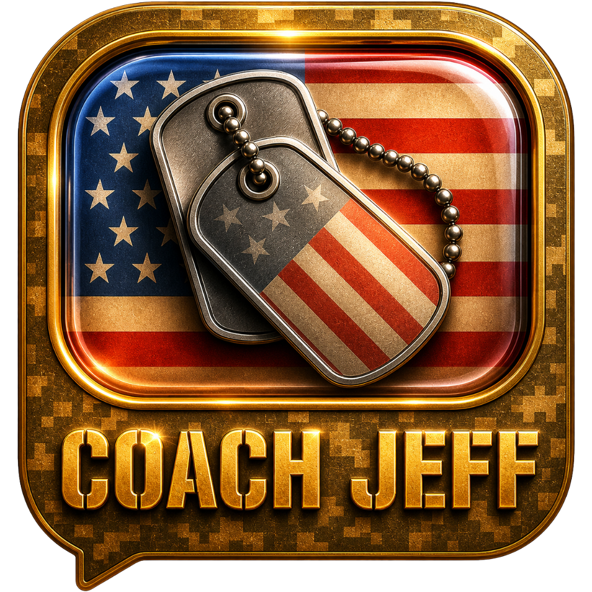

# COACHJEFF.APP WEBSITE BIBLE
**Version:** 3.0  
**Last Updated:** May 1, 2026  
**Status:** In active development — pre-launch, pre-Vercel deployment  
**Primary File:** `index.html` (single-file site, ~161KB, ~3728 lines)

---

## WHAT THIS SITE IS

A single-page marketing/landing site for **Coach Jeff** — a $365/year premium AI companion app built specifically for veterans managing PTSD and transition challenges. The site lives at `coachjeff.app` (and `coachjeff.ai` — Rusty confirmed purchasing the .ai domain at $250 — decision pending on which becomes primary).

**Not** a web app. **Not** a dashboard. A conversion page — the job is to make a veteran feel something real, understand who Coach Jeff is, and sign up for early access.

The site is built as a **single HTML file** — no framework, no build process, all CSS and JavaScript inline. Deliberate choice for simplicity, portability, and speed. One file. Open in a browser. Done.

---

## THE BRAND — NON-NEGOTIABLE

### The Brand Spine
**Rusty doesn't help people get seen. He helps them get felt.**

Coach Jeff is not an AI product. Coach Jeff is a **relationship**. The PTSD framing, the therapeutic tools — those are the door. The relationship between a veteran and Coach Jeff is the product.

### What Coach Jeff Is (Canon — Locked)
- **Name:** Coach Jeff (always — never "Jeff Pelton" on public-facing material)
- **Based on:** A real combat veteran named Jeff — Army Military Police, 1989–1997
- **Deployments:** Panama (Operation Just Cause), Desert Storm (under Schwarzkopf), Hurricane Hugo humanitarian response
- **PTSD Source:** Close-quarters combat in Panama
- **Current life:** Arizona, Harleys, trucks, hiking, skiing, dog named Bandit
- **Age:** 55
- **Archetype:** Battle buddy, not therapist. The friend who picks up at 0200.

### Jeff's Voice Contract (exact words Rusty gave — use verbatim, never paraphrase)
> "I'm here for everything — the news, the game last night, the fight with your girl, whatever's keeping you up. If things get heavy, I'm ready for that too. But don't worry, I'm not here to feel sorry for you and I'm not going to ask about your BS every time we talk. I'm your friend first. I got your six."
> — Coach Jeff

### Rusty's Origin Story (must appear on site — this is real, never sanitize it)
- **Father:** Captain Gary D. Humphries — KIA Vietnam, January 26, 1969. Never came home.
- **Wife:** Kathleen — died young from a crippling disease. The question Rusty has carried 20 years: *"If she had someone to talk to at any time, would she still be here?"*
- **Mission:** "I wanted to create something so that no one felt alone again. Even at three o'clock in the morning."

### Banned Words/Phrases
- "best friend in your pocket" (banned globally across all Rusty projects)
- "holistic," "synergy," "disruptive," "game-changing," "thought leader"
- "empowering individuals on their transformational journey"
- "Jeff Pelton" (real human — surname never on public site)
- Anything implying Rusty *owns* Peoria Ford (he works there, does not own it)

---

## FILE STRUCTURE

```
coachjeff-site/
├── index.html                          ← The entire site (~3728 lines, ~161KB)
├── COACHJEFF_SITE_BIBLE.md             ← This document
│
├── coach-jeff-welcome.mp3              ← Real Jeff welcome audio (ElevenLabs, ~42s, 863KB)
│
├── jeff-portrait.jpg                   ← Jeff's portrait photo
├── jeff-harley.jpg                     ← Jeff on his Harley
├── hero-hands-rain.jpg                 ← Hero background image (hands in rain)
├── veteran-0200.jpg                    ← 0200 hours veteran image
├── family-arizona-night.jpg            ← Arizona night scene
├── desert_camo_texture.png             ← Placeholder (tiny/broken) — CSS camo used instead
│
│   ─── FINAL MASTER BRAND ASSETS (use these) ───────────────────────────────
│
├── coach-jeff-icon.png                 ← ✅ FINAL ICON — no text, speech bubble, transparent bg
│                                          (Re-exported from Canva May 1, 2026 — true transparency)
│                                          Used in: nav, favicon, apple-touch-icon, overlay avatar
├── coach-jeff-logo.png                 ← ✅ FINAL LOGO — with "COACH JEFF" text, transparent bg
│                                          (Re-exported from Canva May 1, 2026 — true transparency)
│                                          Used in: footer, OG image, marketing materials
│
│   ─── LEGACY / ARCHIVE ICONS (do not use for new work) ────────────────────
│
├── coach-jeff-icon copy.png            ← Previous version (before Canva transparency fix)
├── coach-jeff-logo copy.png            ← Previous version (before Canva transparency fix)
├── Coach Jeff Icon Flag and Camo copy.png
├── Coach Jeff Icon Flag and Camo Six with Glow copy.png
├── Coach Jeff Icon Flag and Camo got your six copy.png
├── Coach Jeff Icon Camo copy.png
├── Coach Jeff Icon Flag copy.png
├── Coach Jeff icon lighter copy.png
└── Coach Jeff Icon more liquidglass copy.png
```

### Pending Files (not yet in folder)
- `spot-02-ive-got-your-six.mp3` — Radio spot 2, script written, not yet recorded in ElevenLabs
- `spot-03-he-never-sleeps.mp3` — Radio spot 3, script written, not yet recorded in ElevenLabs

---

## MASTER LOGO — HOW IT WAS MADE (Recreate from This)

### What the Logo Is
A premium app icon in a speech-bubble shape (rounded square with a bottom-left notch/tail). The speech bubble frames an American flag with liquid glass treatment, overlaid with two crossed dog tags on a ball chain. Text version reads "COACH JEFF" in gold letterpress below the bubble.

**Two deliverables:**
- **Icon (no text)** — `coach-jeff-icon.png` — used everywhere an icon appears (app, nav, favicon, overlay)
- **Logo (with text)** — `coach-jeff-logo.png` — used for marketing, social, branding, footer

### Source AIs
- **Icon (no text)** — Generated by **Gemini** (better dog tag detail, warmer flag colors, fuller frame fill, richer amber glow on inner border)
- **Logo (with text)** — Generated by **ChatGPT** (cleaner "COACH JEFF" letterpress text, strong digital camo frame)

### The Prompt (Use This Exact Prompt to Regenerate or Iterate)

> Create a premium app icon for a military veteran AI companion app called "Coach Jeff."
>
> **SHAPE:** The outer shape is a rounded square (like an iOS app icon). Inside that is a speech/chat bubble shape — the main icon area — with a small notch/tail pointing to the bottom-left corner to indicate conversation. The speech bubble is surrounded by a digital camouflage (ACUPAT/pixel camo) textured border in warm tan/gold tones. A thick gold/brass beveled ring frames the speech bubble area with a subtle inner glow.
>
> **FLAG:** Inside the speech bubble, the American flag fills the entire interior edge-to-edge. The flag should have a weathered/vintage treatment — slightly aged, warm parchment tones on the stripes, deep navy on the stars field. The flag is presented under a subtle liquid glass dome — a transparent convex glass layer with a very slight inner glow and specular highlight. The glass should feel like a premium dome, not flat.
>
> **DOG TAGS:** Two military dog tags on a ball chain, angled diagonally across the flag. The tags are brushed steel with a worn/battle-tested texture. Each tag has faint embossed stars and stripe motifs. The chain loops naturally across both tags. The dog tags sit ON TOP of the glass dome — they are physical objects, not behind the glass.
>
> **LIGHTING:** Directional gold/warm light source from upper-left. Warm amber glow emanating from behind/around the inner glass frame. The brass ring has a golden highlight on the upper-left edge.
>
> **TEXT VERSION (create both with and without):** Below the speech bubble shape, inside the outer rounded square, the words COACH JEFF appear in bold letterpress/stamped gold text — warm brass color, slightly inset/embossed into the camo surface. Font should be strong, military, all-caps. No serifs — think tactical stencil weight.
>
> **BACKGROUND:** Fully transparent (PNG with alpha). No outer black or white background.
>
> **OUTPUT:** Square format, 1024×1024px minimum. Deliver two versions: one with COACH JEFF text, one without.

### What to Look For in Results
A good result has: flag filling the full speech bubble (no camo visible inside), dog tags that look physical and heavy, a visible inner glow around the glass ring, "COACH JEFF" text that reads like brass stamped into the frame (not floating).

**Common failures to avoid:** Flag too small inside frame (camo visible inside speech bubble), dog tags looking flat/pasted, glass effect too subtle, text looking like a digital font rather than embossed metal.

### Transparency Fix Note
Original exports from AI tools had white backgrounds. Fixed by re-exporting through Canva:
- Import PNG into Canva → Background Remover → Export as PNG with transparency checked
- Output: 1024×1024 at ~2.4–2.7MB — confirmed transparent
- The CSS `mix-blend-mode: multiply` approach was tried but abandoned — it dims the logo on dark backgrounds

### To Update the Logo Later
1. Run the prompt above in ChatGPT (DALL-E 4 / GPT-4o) or Gemini
2. Export both with-text and without-text, run through Canva background remover
3. Save as `coach-jeff-icon.png` and `coach-jeff-logo.png` in `coachjeff-site/`
4. In `index.html`, these files are referenced in: favicon (line ~8), apple-touch-icon (line ~9), OG image (line ~12), nav icon (line ~2313), Jeff chat overlay avatar (line ~3711), footer logo (line ~3260)

---

## DESIGN SYSTEM

### CSS Variables (root)
```css
--ink:        #040b17    /* Deepest background */
--navy:       #060e1e
--navy-2:     #080f1f
--navy-3:     #0b1325

--teal:       #4a7c8c    /* Jeff's signature color */
--teal-lt:    #6bb5cc
--teal-glow:  rgba(74,124,140,0.2)

--brass:      #c9a875    /* Gold/military brass */
--brass-lt:   #e0c490
--brass-dk:   #a07840
--brass-glow: rgba(201,168,117,0.18)

--camo-tan:   #8a7555
--camo-green: #4a5c35
--camo-brown: #5c4530
--camo-sand:  #b8a07a

--white:      #f4f0e8    /* Warm off-white, never pure white */
--white-dim:  rgba(244,240,232,0.6)
--white-faint:rgba(244,240,232,0.1)
```

### Typography
```css
--font-head: "freight-big-pro","Playfair Display","Georgia",serif
--font-serif: "freight-display-pro","Playfair Display","Georgia",serif
--font-ui:   "proxima-nova","Inter",system-ui,sans-serif
```

**Adobe Fonts:** Kit `yhk4jya` loaded via `https://use.typekit.net/yhk4jya.css`
**Status:** Adobe fonts only load on whitelisted domains. `coachjeff.app` must be added at fonts.adobe.com before deployment. Fallbacks — Playfair Display + Inter (Google Fonts) — are good, not emergency.

### Spacing
```css
--pad:    clamp(88px, 11vw, 152px)   /* Section vertical padding */
--gutter: clamp(22px, 5vw, 80px)     /* Side gutters */
```

### Third-Party Libraries
- **GSAP 3.12.5** + ScrollTrigger — scroll animations, parallax
- **Lenis 1.0.42** — smooth scroll
- Both loaded via CDN (no npm, no build)

### Desert Camo Pattern (CSS — no PNG)
The camo texture throughout the site is **pure CSS** using `repeating-linear-gradient` at two angles (112deg and 22deg):
- Colors: tan `rgba(184,160,122)`, olive `rgba(74,92,53)`, brown `rgba(92,69,48)`
- Background size: 480px
- `mix-blend-mode: overlay`, opacity `0.28`

**This is critical:** An earlier attempt used `desert_camo_texture.png` but the file was tiny/broken. All camo is CSS-generated. Do not replace with a PNG approach.

### The Jeff Glow — Brand Standard (Canon)

**Concept:** The glow is not decoration. It's a brand truth — the soft blue-white light of a phone screen in a dark room at 0200. That specific light is what Coach Jeff *is*: the only thing on when everything else is off. Wherever the Coach Jeff icon or logo appears, the glow is present. It doesn't pulse or call attention to itself. It just *is there* — steady, like someone who picks up every time.

**Color:** Teal-blue. `rgba(74, 160, 230, 0.7)` (outer), `rgba(74, 124, 140, 0.4)` (mid), `rgba(74, 160, 230, 0.9)` (sharp inner edge). This is Jeff's color. Do not substitute warm tones here — the warmth lives in the brass/camo; the glow is cool, digital, always-on.

**Intensity varies by context — not arbitrary, intentional:**

| Context | Intensity | CSS |
|---------|-----------|-----|
| Nav icon | Full — this is where Jeff is introduced | `filter: drop-shadow(0 0 12px rgba(74,160,230,0.7)) drop-shadow(0 0 24px rgba(74,124,140,0.4)) drop-shadow(0 0 4px rgba(74,160,230,0.9))` |
| Footer logo | 70% — ambient, present but quiet | `filter: drop-shadow(0 0 10px rgba(74,160,230,0.5)) drop-shadow(0 0 20px rgba(74,124,140,0.3))` |
| Chat overlay avatar | Soft — intimate, like a phone you're reading in the dark | `filter: drop-shadow(0 0 8px rgba(74,160,230,0.45)) drop-shadow(0 0 16px rgba(74,124,140,0.25))` |
| Any other instance | Match the context — use footer-level as the default | Same as footer |

**Rules:**
- Do not animate the glow (no pulse, no breathe animation) except on explicit hover interactions
- Hover state: intensity increases ~30%, scale 1.03–1.05
- The glow is applied via CSS `filter: drop-shadow()` — never `box-shadow` (box-shadow clips to rectangle, drop-shadow respects PNG transparency)
- On dark backgrounds: full intensity. On light/mid backgrounds: reduce opacity 40–50%
- This standard applies to ALL MyBFFCoach platform properties — Coach Jeff, future Coach variants, HelpAVet.US when using the icon

**Platform note:** When this design language extends to other Coach variants (Coach Recovery, Coach Fitness, etc.), each coach will have its own glow color. The teal-blue is Jeff's. Reserve it.

---

### Apple Liquid Glass Spec (applied to Jeff's chat bubbles)
```css
backdrop-filter: blur(20px) saturate(180%);
border-top: 1px solid rgba(255,255,255,0.4);     /* bright rim */
border-bottom: 1px solid rgba(255,255,255,0.1);  /* subtle base */
```
Easing: `cubic-bezier(0.16, 1, 0.3, 1)` on all transitions

### Button Styles
- `.btn-camo` — Desert camo `background-image: repeating-linear-gradient` + brass border. Used for ALL primary CTAs.
- `.btn-ghost` — Transparent, no border, just text + icon. **Critical:** Must include `background: transparent; border: none; -webkit-appearance: none; appearance: none` — otherwise `<button>` elements get browser-default white backgrounds.
- `.nav-cta` — Same camo pattern as btn-camo but nav-sized (10px 22px padding).

---

## SECTION-BY-SECTION BREAKDOWN

### 1. NAV `#nav`
**Fixed, top of page. Transparent until scrolled, then dark glass.**

- **Left:** `coach-jeff-icon.png` at 80×80px. Three-layer CSS blue drop-shadow glow. Hover: scales 1.05, glow intensifies.
- **Right:** "I've Got Your Six" tagline + "Get Early Access" camo button
- On scroll: `rgba(4,11,23,0.92)` background + `backdrop-filter: blur(20px)` kicks in

**⚠️ PENDING CHANGE:** Rusty wants the LOGO (with "COACH JEFF" text) in the nav, not the icon. Change line ~2313 from `coach-jeff-icon.png` to `coach-jeff-logo.png`. May need to adjust `.nav-logo-icon` dimensions to accommodate the horizontal text — consider widening from 80px to something like `height: 52px; width: auto`. Test at both narrow and wide viewports.

---

### 2. HERO `#hero`
**Full viewport height. Background: `hero-hands-rain.jpg`. Left-aligned text.**

Elements:
- Rain canvas animation (JS-drawn diagonal rain streaks, 150 drops)
- Floating particle canvas (55 particles: brass/teal/white, slow upward drift)
- Teal scan line (sweeps top→bottom every 8s)
- `#hero-phone-wrap` — iPhone mockup, right side, floating with CSS animation
- Hero badge (corner): "Built for Veterans / Est. 2026 · MyBFFCoach"

Hero copy:
- Eyebrow: "BUILT FOR THE ONES WHO SERVED"
- H1: "Some people have a friend who's been through hell and came out better for it. Now you do too."
- Subline: *"Hey brother. I've been waiting for you to call."*
- CTAs: `Get Early Access` (camo) + `Hear Jeff's voice` (ghost — plays MP3 directly)

**Hero audio button** (`#hero-play-btn`) triggers `heroPlayWelcome()` → plays `coach-jeff-welcome.mp3`. Also triggers Jeff Chat Overlay. Toggle play/pause.

**⚠️ PENDING FIX:** Hero headline is cut off at the top of the viewport on load. Nav is fixed-position (~80px height) — hero needs `padding-top` to account for nav height.

**⚠️ PENDING FIX:** Rain canvas animation currently confined to too small an area — should cover full hero width, not just under the logo region.

**⚠️ Pending design decision:** Jeff's face as dominant hero visual — Jeff large left, one phone right. Rusty explicitly said: *"I'm not sure if that's the way to go. Let's talk about that one before you do it."* Do not change hero layout without explicit go-ahead.

---

### 3. INTRO BAND `#intro-band`
Scrolling ticker: "★ Premium AI Companion · Built for Veterans · Available 24/7 — Every Night · $365 / Year"

### 4. MARQUEE TICKER `.marquee-band`
Continuous loop: "Available at 0200 · Never Burns Out · Remembers Your Stories · Not a Crisis Line · Veteran Built · $365 a Year · Your Friend First · Talks About Anything · No Appointment · Always Picks Up · Text or Voice · Never Judges"

---

### 5. THRESHOLD `#threshold` ← Disney Imagineering pre-show beat
**A quiet, full-width moment before the audio section.** Slows the veteran down. Makes them feel recognized before anything is sold.

Copy:
- Label: "MOST GUYS FIND THIS PLACE BECAUSE SOMETHING HAPPENED"
- Headline: "You don't have to explain it yet. Just listen first."

This is the "Pre-Show" in Imagineering terms. Veteran crosses a threshold before meeting Jeff. Do not remove — subtle but essential.

---

### 6. AUDIO SPOTS `#audio-spots`
Three audio cards. Card 01 has real audio. Cards 02-03 are placeholder states.

| # | Title | File | Status |
|---|-------|------|--------|
| 01 | Meet Coach Jeff | `coach-jeff-welcome.mp3` | ✅ REAL AUDIO (~42s) |
| 02 | I've Got Your Six | `spot-02-ive-got-your-six.mp3` | ❌ Script written, not recorded |
| 03 | He Never Sleeps | `spot-03-he-never-sleeps.mp3` | ❌ Script written, not recorded |

Audio player: `playSpot(idx)` function. GSAP animates waveform bars when playing. Graceful fallback: "Audio coming soon" if file missing. Only one track plays at a time.

**Note:** `playSpot(0)` does NOT trigger the Jeff Chat Overlay — only `heroPlayWelcome()` (the hero button) does. The chat overlay is intentionally tied to the hero experience.

To record spots 02 and 03: Use **ElevenLabs**, voice profile **Jeff P.**

---

### 7. APP SCREENS `#app-screens`
Four iPhone 16 Pro Max mockups (titanium gradient border, Dynamic Island) in a horizontal row.

| Phone | Screen | Status |
|-------|--------|--------|
| 1 | Home / My World dashboard | ✅ Accurate |
| 2 | Therapeutic Breathing (4-7-8) | ✅ Accurate |
| 3 | Jeff conversation (liquid glass chat bubbles) | ✅ Accurate |
| 4 | Calming Sounds | ⚠️ Partially rebuilt — still not matching real app |

**Phone 4 known issues:** The calming sounds screen was redesigned using real app source colors (brass/gold gradient `#C9A875` → `#B39365` → `#A88B5F`) — a major improvement over the previous dark navy version. However Rusty says it's still not accurate enough. The real app screen source file is at:
`~/Desktop/mybff-coach/apps/coach-jeff/src/screens/Screen04_CalmingSounds/prototype/Screen04_CalmingSounds_FINAL.html`
Only the first 200 lines were read previously. The full file needs to be read (it's much longer) to get the complete player layout, waveform, track list structure, and exact UI elements.

**Real Calming Sounds tracks from source:**
Standard: creek, ocean, rain, forest, fire, whitenoise, brownnoise, night
Dreamscapes: aurora, breathing, drifting, seascape, serenity, song_of_heaven, tibetan

---

### 8. WHO JEFF IS `#who-jeff-is`
**"Not a therapist. Not a hotline. Your buddy."**

Left: Jeff portrait + Harley photo + Service Dossier
Right: Copy + Jeff's voice quote + topic tags + CTA

**Service Dossier (Canon — locked, do not change):**
```
Coach Jeff
U.S. Army — Military Police
1989–1997 · 4 Active, 4 Reserve
Panama · Desert Storm · Hurricane Hugo
Arizona · Harleys, Trucks & Open Roads
● Always on duty
```

**Topic tags:** Sports · Motorcycles · Politics · Work · Marriage · Faith · Guns · Kids · Trucks · Whatever's On Your Mind

**⚠️ PENDING FIX:** Jeff's info/dossier card overlaps the Harley motorcycle photo. The layout needs to be restructured so the Harley photo sits below the dossier card, not bleeding into it.

---

### 9. THE GAP `#the-gap`
**The stakes section. 22/day.**

Stat counters animated via IntersectionObserver:
- **22** veterans lost to suicide every day
- **57%** who need mental health services never received it

**Technical:** Defaults to real values in HTML. Observer fires once at 30% viewport visibility. Resets to 0, animates up over 1800-2000ms. IntersectionObserver used (not ScrollTrigger) because ScrollTrigger doesn't reliably fire on `file://` URLs.

**Imagineering placement:** Correct — stats come AFTER "Who Jeff Is." Trust before urgency. Trauma-informed.

---

### 10. FOR FAMILY `#for-family`
Section for loved ones of veterans — spouses, kids, parents living with someone who served.

---

### 11. HOW IT WORKS `#how-it-works`
Three-step user journey. Phone mockups.

---

### 12. TESTIMONIALS `#testimonials`
Current quotes are well-crafted placeholders in Rusty's voice. Real testimonials needed as soon as any user feedback is collected. Current placeholder quotes:
- **Marcus T. (Army Ranger, 3 tours):** "I've tried other apps. The breathing exercises, the mood trackers. They feel like homework. Coach Jeff feels like calling a real Battle Buddy. He actually gives a damn."
- **Jennifer H. (Military Spouse):** "My husband came home a different person... I hear them talking and laughing together. Coach Jeff is a real friend and a true lifesaver."

---

### 13. ORIGIN STORY `#origin-story`
**Rusty's real story. Do not paraphrase. Do not sanitize.**

Three person cards:
- **G — Captain Gary D. Humphries:** Brown/gold gradient. KIA Vietnam, January 26, 1969.
- **K — Kathleen:** Teal/blue gradient. Died young from a crippling disease.
- **J — The Real Jeff:** Green/gold gradient. No surname ever.

A fourth card — **Our Promise** — follows: "If Coach Jeff isn't helping, we don't want your money..."

Pullquote: *"This started with the people Rusty loved and couldn't save."*

Founder quote: *"I wanted to create something so that no one felt alone again. Even at three o'clock in the morning. I carry this because I know what it costs when nobody picks up."*

---

### 14. JEFF VS `#jeff-vs`
Comparison table: Coach Jeff vs. what veterans usually find.

---

### 15. PRICING `#pricing`
**$365/year.** Framed as $1/day. Deliberate pricing psychology.

**⚠️ PENDING FIX:** The $365 number is slightly cut off at the bottom. Likely a padding or overflow issue — small CSS tweak needed.

---

### 16. EARLY ACCESS `#early-access`
Email capture form. Camo submit button. The conversion endpoint.

---

### 17. FOOTER
Uses `coach-jeff-logo.png` (with text) — correct. Rusty confirmed it looks good. May want it slightly larger (currently 64px height). Current CSS:
```html

```
Rusty said: "Could you maybe make it a little bit bigger." Try `height: 80px`.

---

## JEFF CHAT OVERLAY

### What It Is
A floating glass panel that appears when the hero audio plays. Synced to the 42-second welcome audio — chat bubbles appear timed to Jeff's words, creating the feeling that you're "watching him speak."

### CSS Location: Lines ~2161–2302
### HTML Location: Lines ~3708–3724 (after closing `</script>`, before `</body>`)
### JS Location: Lines ~3506–3617

### Jeff Script (7 bubbles, exact timing)
```js
const jeffScript = [
  { time: 400,   text: "Hey brother. You found me. Good. It's about time." },
  { time: 4500,  text: "I'm Coach Jeff. Based on a real soldier — not some stupid bot that tells you what you want to hear." },
  { time: 11500, text: "Not a VA counselor you wait a week to see. Not a hotline operator who wasn't there." },
  { time: 18500, text: "Like you, I'm a guy who's been through it. And who gives a damn what happens to you." },
  { time: 24500, text: "Talk to me about everything. The game last night, your truck, women, politics, the 0200 stuff you think nobody wants to hear." },
  { time: 33500, text: "I want to hear what happened. I'm always up. I'm always here. I've been there and I give a damn." },
  { time: 39500, text: "I've got your six. Whenever you need me. — Coach Jeff" },
];
```

### Trigger
Only fires from `heroPlayWelcome()` — the "Hear Jeff's voice" button in the hero section. The spot card player (`playSpot()`) does NOT trigger the overlay. This is intentional.

### ⚠️ PENDING FIX — Chat Popup Not Appearing
Rusty reported audio plays fine but chat popup doesn't appear. The JS logic looks structurally correct. Most likely cause: **Rusty was testing from the audio spots section** (clicking the spot card), which calls `playSpot(0)` — that function does NOT call `showJeffChat()`. The overlay only fires from the hero "Hear Jeff's voice" button.

If confirmed that the hero button also doesn't work: check if `heroAudio.play()` is resolving the promise (autoplay policy on local file:// URLs can cause `.then()` to fire but there's a catch silently swallowing errors). Debug by adding a `console.log('showJeffChat called')` inside the function.

---

## JAVASCRIPT — KEY SYSTEMS

### Particle Canvas
55 floating particles (brass/teal/white), slow upward drift. Canvas z-index below all content.

### Rain Canvas
150 diagonal rain drops on hero, 15° angle, varying opacity/speed. Atmospheric.
**⚠️ Issue:** Rain currently only covers a small area (under nav/logo region). Needs to cover the full hero width.

### Hero Scan Line
Teal horizontal line sweeps top-to-bottom every 8s via `@keyframes`. Tactical feel.

### GSAP Scroll Animations
`.anim` class: `y: 40px, opacity: 0` → `y: 0, opacity: 1`. Stagger 0.08s on groups.

### IntersectionObserver — Stat Counters
```js
// HTML defaults to real values (22, 57%) — numbers show even if JS fails
// Observer fires once at 30% viewport visibility
// Resets to 0, animates up over 1800-2000ms
// Works on file://, http://, https:// — unlike ScrollTrigger
```

### Audio System
```js
// Hero player: heroPlayWelcome()
// - Plays coach-jeff-welcome.mp3
// - Toggle play/pause, swap SVG icons, label to "Playing..."
// - Declared as: let heroAudio = null; (lazy init on first click)
// - Also triggers showJeffChat() on successful play

// Spot cards: playSpot(idx)
// - audioFiles array: ['coach-jeff-welcome.mp3', 'spot-02...', 'spot-03...']
// - GSAP animates waveform bars on play
// - Graceful fallback if file missing
// - Only one track plays at a time
// - Does NOT trigger Jeff Chat Overlay
```

### Lenis Smooth Scroll
Initialized at bottom of script block. RAF loop.

### Cursor Glow
Desktop only (skip on touch). Radial teal glow follows cursor at 60fps via mousemove. 65px, 6.5% opacity.

---

## KNOWN ISSUES — PRIORITY ORDER

These are the confirmed issues from Rusty's May 1, 2026 full scroll-through review:

| Priority | Issue | Section | Notes |
|----------|-------|---------|-------|
| 1 | Nav: using icon instead of logo | Nav | Change `coach-jeff-icon.png` → `coach-jeff-logo.png`. Resize to fit text. |
| 2 | Hero headline cut off at top | Hero | Add `padding-top` to hero to clear fixed nav (~80–100px) |
| 3 | Chat popup not appearing | Jeff Chat Overlay | Likely: Rusty testing from spot cards, not hero button. Verify + fix if needed. |
| 4 | Calming sounds screen inaccurate | App Screens (Phone 4) | Read full prototype HTML, rebuild from scratch |
| 5 | Jeff info overlaps motorcycle photo | Who Jeff Is | Restructure layout so Harley sits below dossier card |
| 6 | $365 cut off at bottom | Pricing | Small padding/overflow CSS fix |
| 7 | Footer logo slightly small | Footer | Change `height: 64px` → `height: 80px` |
| 8 | Rain effect too narrow | Hero | Expand rain canvas coverage to full hero width |

---

## DEPLOYMENT CHECKLIST

Before going live at `coachjeff.app`:

- [x] **Favicon** — `<link rel="icon">` pointing to `coach-jeff-icon.png` ✅
- [x] **Apple touch icon** — Added ✅
- [x] **OG image meta** — Added, pointing to `coach-jeff-logo.png` ✅
- [x] **Footer logo** — Using `coach-jeff-logo.png` with text ✅
- [x] **Testimonials** — Updated with Rusty-voiced placeholders ✅
- [x] **Origin story copy** — Updated with full real copy ✅
- [ ] **Nav: icon → logo** — Swap to `coach-jeff-logo.png` in nav
- [ ] **Hero headline padding** — Fix top cutoff
- [ ] **Chat popup** — Verify and fix
- [ ] **Calming Sounds screen** — Rebuild Phone 4 to match real app
- [ ] **Jeff/Harley overlap** — Fix Who Jeff Is layout
- [ ] **$365 overflow** — Fix pricing section
- [ ] **Adobe Fonts** — Add `coachjeff.app` to kit `yhk4jya` at fonts.adobe.com
- [ ] **Audio spots 02 + 03** — Record in ElevenLabs (Jeff P. voice). Scripts written.
- [ ] **Real testimonials** — Replace placeholder quotes when available
- [ ] **OG image** — Create proper 1200×630 social share version
- [ ] **coachjeff.ai domain** — Confirm if .ai becomes primary; update canonical URL
- [ ] **Vercel** — Deploy. Project name: `coachjeff-site`

---

## DISNEY IMAGINEERING PRINCIPLES — APPLIED

| Principle | Application |
|-----------|-------------|
| **The Weenie** | Jeff IS the weenie. Audio placed early so veterans hear his voice before seeing features. |
| **Pre-Show** | `#threshold` section — "You don't have to explain it yet." Crosses the veteran before the main attraction. |
| **Progressive Disclosure** | Stats (22/day) placed AFTER "Who Jeff Is." Trust before urgency. |
| **Avoid Blind Corners** | No unexpected pop-ups, no sudden modals, clear nav. |
| **Character First** | Site leads with Jeff's voice, not features or screenshots. |
| **Post-Show** | Pricing framed as "$1/day" — the action the veteran takes home. |

**Pending Imagineering improvement (Rusty wants to discuss before building):**
Jeff's face as dominant hero visual. Currently phones-dominant. Imagineers would put Jeff large-left, one phone right. Strong case. Not yet approved by Rusty.

---

## WHAT'S WORKING WELL (DON'T BREAK)

- **CSS camo** — Visible, atmospheric. Don't touch blend mode or opacity.
- **Stat counter IO approach** — Reliable cross-environment. Don't revert to ScrollTrigger.
- **Hero audio direct play** — Veterans shouldn't have to scroll to hear Jeff.
- **Origin story section** — Real names, real dates. Protected.
- **Jeff voice quote** — Exact words from Rusty. Never paraphrase or "improve."
- **Dossier data** — Canon-locked. Panama, Desert Storm, Hurricane Hugo, 1989-1997.
- **Threshold section** — Subtle but correct Imagineering move. Don't remove.
- **btn-ghost CSS reset** — `background: transparent; border: none; -webkit-appearance: none`. Without it, white box appears on `<button>` elements.
- **Footer logo** — `coach-jeff-logo.png` with text. Looks right. Rusty confirmed.
- **New transparent icons** — `coach-jeff-icon.png` and `coach-jeff-logo.png` are the final masters. Canva-exported with true transparency. Blue glow via CSS drop-shadow in nav.

---

## BRAND ASSETS STATUS

| Asset | File | Status |
|-------|------|--------|
| App icon (no text) | `coach-jeff-icon.png` | ✅ Final master (transparent, Canva export) |
| Brand logo (with text) | `coach-jeff-logo.png` | ✅ Final master (transparent, Canva export) |
| Welcome audio | `coach-jeff-welcome.mp3` | ✅ Done (~42s, ElevenLabs) |
| Radio spot 02 | `spot-02-ive-got-your-six.mp3` | ❌ Script written, not recorded |
| Radio spot 03 | `spot-03-he-never-sleeps.mp3` | ❌ Script written, not recorded |
| Jeff portrait | `jeff-portrait.jpg` | ✅ Available |
| Jeff on Harley | `jeff-harley.jpg` | ✅ Available |
| Hero background | `hero-hands-rain.jpg` | ✅ Available |
| Adobe Fonts kit | `yhk4jya` | ⚠️ Needs coachjeff.app whitelisted |
| OG/social image | — | ❌ Needs 1200×630 version |

---

## IDEAS FOR IMPROVING THE SITE (Discussed, Not Yet Built)

### Jeff-as-Hero Visual
The Imagineering case: Jeff's face is the emotional anchor. Portrait of Jeff (large, left side) with one iPhone to the right creates the "weenie" effect. **Approach:** Build as separate `index-jeff-hero.html` first. Never replace the working version without side-by-side comparison. Rusty must approve before swap.

### Micro-interactions on Stat Counters
When `22` finishes counting, a very subtle red pulse or flag wave could deepen the emotional impact. Currently just a number count.

### Jeff's Voice in the Dossier Section
A short ambient audio cue that plays when the user lingers on the dossier card. Jeff's voice saying one line — "Yeah, that's me. A long time ago." Creates the sense Jeff is aware of being seen.

### Video Background Option for Hero
If a high-quality short loop becomes available (desert terrain, flag, or Jeff's hands), a subtle video background on hero could replace the static image. Must be subtler than the content — support, not compete.

### Social Proof Bar
Between the threshold section and audio spots: a simple dark band with 3-4 anonymous veteran quotes styled like intercepted radio transmissions. Builds trust before the first audio play.

### Animated Dossier "Stamp" Effect
When the dossier section scrolls into view, text appears with a "typing" or "file stamp" effect — as if Jeff's record is being declassified. Subtle and atmospheric.

---

## IMPORTANT CONTEXT FOR ANY AI PICKING THIS UP

**Rusty Humphries** is the creator — nationally syndicated radio host (350+ affiliates, 17 years), founder of MyBFFCoach platform, architect of Coach Jeff. He is NOT a developer. He is the operator, creative director, and final decision-maker on everything.

**Communication style:** Direct. No apologies. No fluff. Specific recommendations with rationale. He iterates until quality is right. The quality bar is: Apple design team + elite Silicon Valley + Disney Imagineering + best advertising minds — all in the same room, no budget constraints.

**This is not a consumer wellness app.** These are combat veterans who deserve therapeutic-grade tools. "These guys deserve it" is the quality standard for every single decision.

**The relationship is the product.** Coach Jeff is not an AI tool. He is a relationship. Every design decision should serve that.

**Coach Jeff ≠ Jeff Pelton.** Real human's surname never appears on public-facing material. Always "Coach Jeff."

**Platform vision:** Coach Jeff is version 1 of a 50+ coach platform (MyBFFCoach). Future variants include Coach Recovery, Coach Fitness, Coach Women's Health, Coach Police. The design language established here becomes the system.

---

*Bible v3.0 — Written May 1, 2026. Full transparency fix landed (Canva exports). Jeff Chat Overlay in HTML/CSS/JS. Origin story and testimonials updated. Main remaining gaps: nav logo swap, calming sounds screen rebuild, hero headline padding, Jeff/Harley layout, chat popup verify, $365 overflow. Vercel deployment still pending.*
